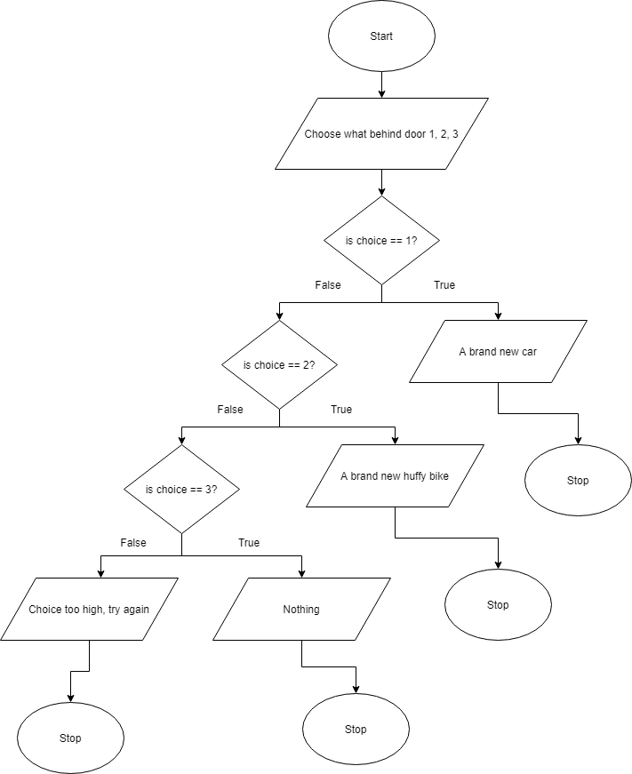

# CPlusPlus

### Project: C2A3 - Chapter 2 and 3

<li> PURPOSE OF PROJECT: This is chapter 2 and 3 for C++ class. Included are problems 2.1, 2.2, 2.3, 2.4, 2.5, 8, 9, 10.                         </li>
<li> DATE: 4/17/2020                              </li>
<li> HOW TO START THIS PROJECT: Copy and paste the file, and just run it in visual studio.                 </li>
<li> AUTHORS: Nhan man                                         </li>
<li> USER INSTRUCTIONS: Follow the directions on screen when running the project.  </li>

<li> The problems can be found here: https://github.com/WestCplusplus/CIS-161-Cplusplus/tree/master/Home%20Work/Chapter%202%20and%203 </li>

### Project: C4A5 - Chapter 4 and 5

<li> PURPOSE OF PROJECT: This is chapter 4 and 5 for C++ class.</li>
<li> DATE: 4/17/2020</li>
<li> HOW TO START THIS PROJECT: Copy and paste the file, and just run it in visual studio.                 </li>
<li> AUTHORS: Nhan man                                         </li>
<li> USER INSTRUCTIONS: Follow the directions on screen when running the project.  </li>

<li> The problems can be found here: https://github.com/WestCplusplus/CIS-161-Cplusplus/tree/master/Home%20Work/Chapter%204%20and%205 </li>
<li> ANSWERS TO PROBLEMS: </li>
3.1. The three common errors made when writing selection structures are: using compound condition rather than a nested selection structure, reversing the decision outside of the selection structure, and using unnecessary selection structure.  
3.2. Using a compound condition and using unnecessary selection can be inefficiet, but they could also produce the correct results.  
3.3. 

 
3.10. A simulation of the three body problem type of program would prove to be difficult to program without loops.  
3.11. Switch: Advantage - concise, easy to read. Disadvantage - less versatile. If/else: Advantage - more versatile. Disadvantage - Not as concise, can be error prone.  
3.12. A while loop can be use when you do not know how many times the program will run. A do while loop always run the program at least once.  
3.13. A browser chess game benefit greatly from a game loop. We can check that while a checkmate haven't been given, the game keep going.  
3.14. Infinite loops are considered bad because it can lead to difficult debugging. If a program runs constantly without any checks, it could fill up the memory allocated and crash the program.  
